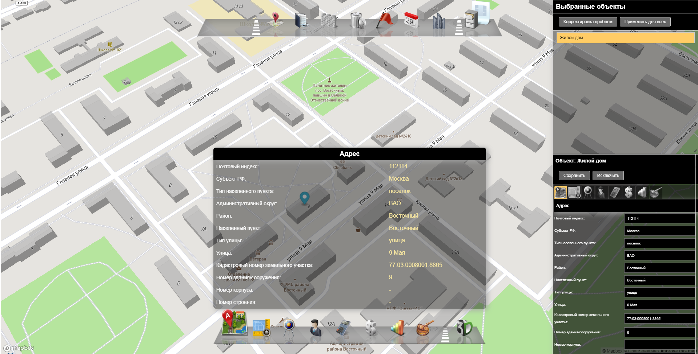
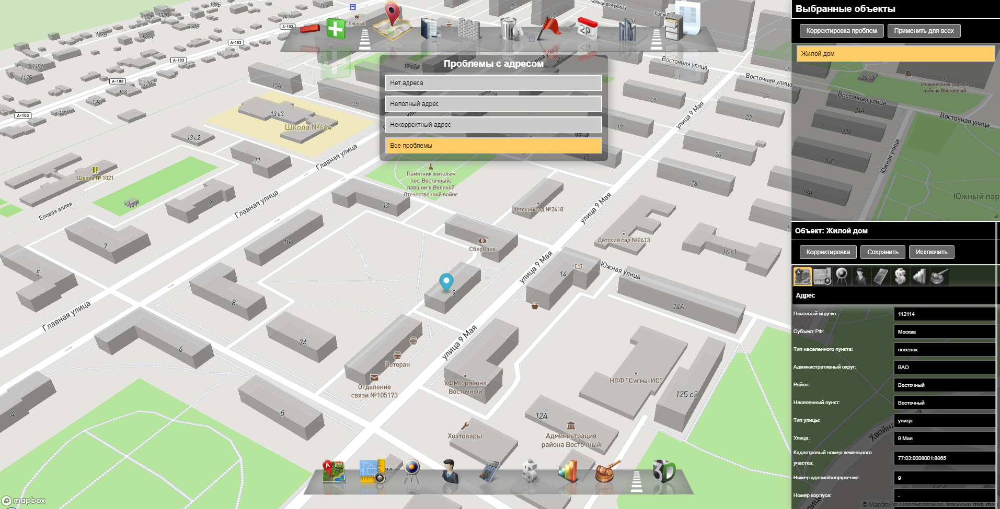

## Геоинформационная система "Профиль объекта недвижимости" (демо-прототип)
Геоинформационная система «Профиль объекта недвижимости» (ИС ПОН) направлена на обеспечение отображения актуальной информации о характеристиках объектов недвижимости с целью их дальнейшего анализа и оперативного устранения различных проблем.
К таким проблемам относятся:
- неоформленные земельно-правовые отношения;
- самовольная застройка;
- нецелевое использование;
- самозахват земельных участков;
- превышение сроков строительства на земельных участков;
- ненадлежащее содержание земельных участков.

Деплой системы для ознакомления: http://109.68.16.185/geomap
В ознакомительной версии отключены алгоритмы исправления проблема и доступна семантика только для района "Восточный" (стартовое расположение камеры).

Использованный стек технологий: J2EE / Java 8 / Spring Boot / Data-JPA / Stream API / PostgreSQL / PostGis / RESTful API / Lombok / jQuery

### Отображение информации об объектах недвижимости

### Исправление проблем с адресацией объекта недвижимости
